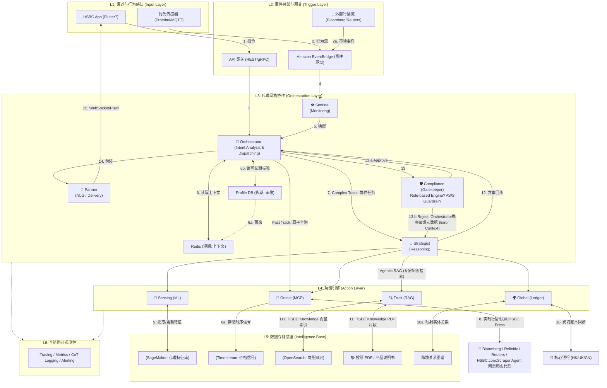

基于你提出的记忆管理优化、可观测性层（L6）以及路径复杂度分流，我为你完成了 v5.0 版本的架构升级。在本次升级中，我强化了系统的“鲁棒性”与“响应效率”，并确保所有新增内容有机地融入了现有分层体系。

---

# HSBC AI原生财富管理系统技术设计文档 (v5.0)

**版本**: v5.0 (Agentic Architecture)
**设计核心**: 编排器驱动的 Agentic Mesh + 动态路径路由 + 全链路可观测性
**最后更新**: 2025-12-27

---

## 1. 业务场景与技术能力映射

我们通过将 10 个特定用户故事解构为底层的通用技术能力调用，实现了从“定制脚本”向“平台化能力”的跃迁。

| 用户故事 | 核心场景 | 技术实现 | 算法/模型 | 数据源 | 核心引擎 |
|---------|---------|---------|-----------|--------|---------|
| **UC-01.2 Kelvin** | 激进钟摆 | 报复性偏差检测 + LCR 压力测试 | **Logistic Regression**<br/>(特征: 交易频率、亏损后间隔、持仓集中度) | Feature Store<br/>(30 天行为窗口) | 🧠 Sensing / ⚙️ SimService |
| **UC-02 Christopher** | 跨境流动性 | 双重压力测试 (FX+Price) + 智能护栏 | **VaR (蒙特卡洛 100 次)** + 地理围栏规则引擎 | GraphDB (跨境账本)<br/>TimeSeries (实时汇率) | 🌍 Global / 🛡️ Compliance |
| **UC-03 Lucas** | 策略选择 | 3 层风险策略生成 (保守/平衡/激进) | **Black-Litterman 模型**<br/>(后验资产配置) | VectorDB (历史回测)<br/>Oracle (实时市场) | ⚙️ SimService / 🧠 Sensing |
| **UC-04 Zhang Wei** | 宏观蝴蝶效应 | DCF 影响引擎 (美联储政策映射) | **Taylor Rule 推导** + DCF 敏感度分析 | MCP 外部源<br/>(Fed Statement) | 📡 Oracle / ⚙️ SimService |
| **UC-05 Li Xiaoya** | 全球守护者 | 意图评分 + 跨境账户即时关联 | **NLP 意图分类器**<br/>(BERT Fine-tuned) | Profile DB<br/>GraphDB | 🧠 Sensing / 🌍 Global |
| **UC-06.2 Patrick** | 湾区自由行者 | KYC 身份桥接 + 实时配额监控 | (跨境身份验证) | 加密身份令牌<br/>Ledger DB | 🌍 Global / 🔍 Compliance |
| **UC-07 Mr. Lin** | 迷雾中的灯塔 | UX 交互感知 + RAG 引证系统 | **Attention 热力图**<br/>(停留时长加权) | SDK 遥测数据<br/>VectorDB (PDF 片段) | 🧠 Sensing / 🔍 Compliance |
| **UC-08 Omar** | 信仰与财富 | 伊斯兰教法引擎 + 文化元数据过滤 | **规则引擎**<br/>(Shariah 白名单/黑名单) | VectorDB (教法文书)<br/>Profile DB (文化标签) | 🔍 Compliance / 🧠 Sensing |
| **UC-09 Thompson** | 实体与抵押 | EPC 绿色金融模拟 + 税务影响评估 | **IRR 计算** + CGT 分段税率模拟 | SimService 税务库<br/>GraphDB (物业关系) | ⚙️ SimService / 🔍 Compliance |
| **UC-10.2 Arjun** | 黄金与全球指数 | 跨资产相关性分析 + 文化执念对冲 | **协方差矩阵** (滚动 252 天) + 情绪对冲逻辑 | TimeSeries (黄金/NIFTY)<br/>Feature Store (文化偏好) | 📡 Oracle / 🧠 Sensing |

---

## 2. 五大核心通用能力引擎 (Functional Engines)

这些引擎是 L4 层的技术支柱，作为 Agent 的“外部感知与行动系统”，通过标准接口支持复杂的财富管理逻辑。

### 2.1 📡 多模态市场预言机 (Multi-Modal Market Oracle)

* **技术实现**: 核心基于 **MCP (模型上下文协议)** 连接外部信号。
* **功能**: 提供统一的“市场真相”。通过 MCP 实时接入 Bloomberg/Refinitiv 等外部源。
* **核心应用**: 实时计算相关性（如黄金与指数相关系数）及执行实时配额监控。
* 断路器模式 (Circuit Breaker)：当 Bloomberg API 连续失败 3 次时，自动切换至 Refinitiv 备用源。
* 数据新鲜度标签：每个行情数据携带时间戳，防止使用过期缓存导致决策偏差。

### 2.2 🧠 客户情境记忆与感知 (Client Contextual Memory & Sensing)

* **技术实现**: 结合 ML 心理分析与特征提取。
* **功能**: 识别财务意图与情绪，无需硬编码规则。
* **核心应用**: **UX 传感器**将 SDK 捕获的行为数据转化为犹豫分值；**文化元数据**在画像中引入非财务维度（如教法偏好）。

### 2.3 🌍 全球资产编排器 (Global Asset Orchestrator)

* **技术实现**: 确定性银行 API 网格。
* **功能**: 将全球分布的资产视作单一动态账本。
* **核心应用**: **KYC 身份桥接**利用加密令牌实现跨境身份复用，支持 24h 开户。

### 2.4 ⚙️ 策略与模拟引擎 (Strategy & Simulation Engine)

* **技术实现**: 确定性金融计算引擎。
* **功能**: 提供“代码即建议”，运行复杂数学模型。
* **核心应用**: 执行 **LCR 流动性模拟**防止全押错误，以及评估跨国税务 (CGT) 的动态影响。

### 2.5 🔍 信任锚定响应引擎 (Trust-Anchored Response Engine)

* **技术实现**: **RAG (检索增强生成)** 架构。
* **功能**: 确保 AI 回复的内容 = CIO (50%) + Search(Bloomberg/Router/HSBC.com) (30%) + HSBC Product (20%)
* **核心应用**: **RAG 引证系统**将 AI 摘要与 PDF 原文段落深度绑定，解决 LLM 幻觉问题。

---

## 3. 系统架构设计 (System Architecture Blueprint)

系统采用 **“感官-大脑-肌肉”** 的分层设计，确保各模块解耦且高效协作。

### 3.1 总体架构蓝图与交互流

精简版



---

## 4. 代理协作系统 (The "Agentic Mesh")

系统采用**“星型编排”**逻辑，Agent 之间不直接对话，由 **Orchestrator** 统一调度，确保决策逻辑可控且一致。

### 4.1 Agent 协作机制与时序说明

1. **Orchestrator (主控：编排代理)**: 中央路由器。负责任务分解、调用 LLM 生成执行计划。
   - 不仅仅是 Prompt：它还需要 状态管理逻辑 (State Management)。
   - 核心支撑：它连接 Redis (短期记忆) 以保持对话连贯性，并连接 LLM (Bedrock) 运行任务分解算法。
   - 它不需要特定的“计算服务”，但它是所有 L4 引擎的“调度员”。
2. **Sentinel (哨兵代理)**: 24/7 事件监听器（类似 Apple Watch 监控）。
   - 通过 **TimeSeries** 监测市场（如汇率跌 5%）或 **SDK** 监测行为（如停留过久）。
   - 一旦触发，在任务黑板留言，唤醒编排器。
3. **Strategist (战略家代理)**: 逻辑推理核心。被唤醒后调用 **SimService** 执行 DCF、ROI 或蒙特卡洛模拟。
   - 战略家 (Strategist) 负责推理方案，但它不擅长复杂的数学计算。
   - SimService (Simulation Engine 策略模拟服务) 是它的“计算器”。SimService 输出应包含关键假设列表（如"假设美联储 2025 年加息 25bp × 3 次"，"假设个人所得税支出 $45k (下月到期)"）
   - 运行逻辑：在 UC-01.2 (Kelvin) 场景下，Strategist 意识到客户有报复性偏差后，会调用 SimService 运行 LCR (流动性覆盖率) 压力测试。Strategist 负责根据计算结果建议“流动性梯队策略”，而具体的数字预测是由 SimService 完成的。
4. **Compliance (合规代理)**: 
   - 合规官 (Compliance) 是决策的最后一道门控。
   - “带记忆的重试”：Strategist 第二次回答时，ShortMemory 中应包含“上一次被拒的原因”，否则它可能会陷入死循环，重复同样的错误。如果 13.b 的循环超过 2 次（Max_Retries=2），则由 Orchestrator 直接切断循环，通过 Partner 发送：“由于合规逻辑较复杂，我们的理财专家正在介入，请稍后。”
   - 模糊的，不确定的情况，不在知识范围内的或者不在规则内的情况，均需要 RM 人工介入。
5. **Partner (关系伙伴代理)**: 交付专家。负责将冷冰冰的财务模型包装为符合客户文化背景的情感话术。
   - 不仅仅是 Prompt：它需要 交付/推送服务 (Delivery Infrastructure)。
   - 核心支撑：它需要 WebSocket/Push 通道将结果推送到 App。
   - 虽然它使用 Prompt 来进行情感话术包装（如针对 UC-10.2 Arjun 的文化适配），但它也需要根据 Sensing (感知) 引擎返回的“犹豫分值”来决定是否触发“人工移交”逻辑。

### 4.2 核心协作流 (以 UC-02 跨境护栏为例)

| 阶段 | 参与者 | 动作说明 | 输入/输出 (IPO) |
| --- | --- | --- | --- |
| **1. 监测** | **Sentinel** | Oracle 反馈 GBP 汇率波动 -5%，Sentinel 扫描 **GraphDB** 识别资产触警风险。 | **In**: 实时汇率; **Out**: 告警事件 |
| **2. 路由** | **Orchestrator** | 接收事件，查阅 **ShortMemory** 确认会话状态，调度 **Strategist** 执行救援。 | **In**: 告警事件; **Out**: 模拟指令 |
| **3. 策略** | **Strategist** | 调用 **SimService** 运行压力测试，生成“自动去杠杆”置换方案。 | **In**: 资产组合; **Out**: 调仓建议 |
| **4. 拦截** | **Compliance** | 检查方案是否违反跨国税务影响，确认操作处于客户协议授权内。 | **In**: 调仓建议; **Out**: 准入令牌 |
| **5. 交付** | **Partner** | 封装专业术语，通过 WebSocket 推送主动预警及对冲详情。 | **In**: 准入令牌; **Out**: Push 消息 |

### 4.3 Use Case 执行流深度分析 (Input-Process-Output)

以 **UC-01.2 Kelvin (激进钟摆 - 实时纠偏流)** 为例：

* **Input**: Kelvin 点击“全仓买入 1.5M SGD T-Bills”。
* **Process**:
  1. **Orchestrator** 调用 **SensingService** 从 **Feature Store** 获取偏差评分 (0.85)。
  2. **Strategist** 调用 **SimService** 发现下月个人所得税支出将导致流动性覆盖率 (LCR) 跌破安全线。
  3. **Compliance** 依据风险等级 3 (Balanced) 拦截极端集中度交易。
* **Output**: **Partner Agent** 弹出琥珀色提示框，引导客户至“流动性梯队策略”。

### 4.4 针对简单问题，系统会走一条**"快速通道 (Fast Track)"**

以下是具体执行逻辑：

#### 1. 核心机制：动态路径剪枝 (Dynamic Path Pruning)

Orchestrator 在第一步（意图识别）时，会根据问题的复杂度进行路径裁剪。

**路径 A：复杂决策（完整流程）**
- **场景**： “我想在英国买房，请根据我的资产状况建议一套跨境财务方案。”
- **执行**： 激活 Strategist 进行多方案模拟，激活 Sensing 分析风险偏好，激活 Compliance 进行深度审查。

**路径 B：简单查询（快速通道）**
- **场景**： “查询我的英镑账户余额。”
- **执行**： Orchestrator 识别到这是 Atomic Task (原子任务)，直接跳过中转环节。

#### 2. 简单问题的执行流 (Step-by-Step)

以用户询问 “现在英镑对港币的汇率是多少？” 为例：

**L1 -> L2 (接入)**： 用户在 App 输入，API 网关透传至 Orchestrator。

**L3 (Orchestrator - 意图识别)**：

Orchestrator 调用轻量级模型判定：这是一个“实时信息查询”任务。

剪枝决定： 无需 Strategist 模拟，无需 Sensing 分析行为。

**L4 (Action - 直接取数)**：

Orchestrator 直接下达指令给 Oracle (MCP 连接器)。

Oracle 从实时行情源（如 Bloomberg）抓取汇率 1 GBP = 10.12 HKD。

**L3 (Compliance - 自动准入)**：

Compliance 进行极简校验（例如：该数据是否公开可读？是。无敏感信息风险）。

**L3 (Partner - 包装)**：

Partner 将数字转化为自然语言：“现在的英镑兑港币汇率为 10.12。需要我为您计算兑换金额吗？”

**L1 (交付)**： 通过 WebSocket 秒级返回 App。

#### 3. 不同问题的"路径复杂度"对比

| 问题类型 | 激活组件 | 路径特征 | 耗时 (估算) |
| 原子查询 (汇率、余额、网点) | Orchestrator + Oracle/Global | 直连路径：跳过脑暴，直接查库。 | < 1s |
| 知识问答 (什么是 ISA 账户？) | Orchestrator + Trust (RAG) | 检索路径：跳过外部连接，只看内部 PDF。 | 1-2s |
| 预测类/建议类 (我该买这只基金吗？) | 全量组件 (Strategist + Sensing + Compliance) | 循环路径：反复修正，多次调用 LLM。 | 5-10s |

#### 4. 架构中的“短路”设计 (Short-Circuiting)

在你的 Mermaid 图中，你可以通过以下逻辑优化简单问题的处理：

Orchestrator 的 Router 功能： 它不只是 Planning，它还是一个智能路由。若 Intent_Score 判定为“信息获取型”，Orchestrator 直接向 L4 下达指令，绕过 Fork-Join 同步逻辑。

缓存命中: 针对高频简单问题（如网点地址、通用牌价），Orchestrator 优先读取 ShortMemory，实现零延迟反馈。

### 4.5 降级策略与断路器 (NEW)

**目标**：确保单个服务失败不会级联导致整体不可用。

| 服务 | 故障场景 | 降级策略 | 用户体验 |
|------|---------|---------|---------|
| **Oracle** | Bloomberg API 超时 | 切换至 Refinitiv 备用源 | 行情延迟 5-10s，显示"数据来源：备用" |
| **SimService** | 计算引擎崩溃 | 返回基于历史数据的预计算结果 | 显示"*基于历史模型预测" |
| **Sensing** | 特征提取失败 | 使用客户长期画像的默认值 | 建议更保守，提示"当前使用标准风险等级" |
| **Compliance** | Rule-based Engine 不可用 | 直接返回"无法验证合规性，请联系 RM" | 自动转人工 |
| **Global** | 跨境 API 失败 | 禁用跨境功能，仅展示本地资产 | 提示"跨境服务暂时不可用" |

---

## 5. 客户记忆系统 (Memory System)
系统必须具备“记忆”能力，才能实现真正的 AI 原生交互。

* **短时记忆 (Redis)**: 存储会话上下文及临时模拟参数，支持多轮“What-if”咨询，防止刷新丢失。
  - 在 Redis 层引入乐观锁（version stamping）。Orchestrator 应实现任务队列优先级机制，避免同一客户的并发任务冲突。
* **长时记忆 (Feature Store & GraphDB)**: 存储经过机器学习模型量化的行为特征和跨境实体关系，实现跨越数月的资产演进追踪。
  - 定义 TTL 策略：会话结束后 24h 自动归档至冷存储。
  - 实现预热机制：高价值客户登录时，提前将长期记忆加载到 Redis。

### 5.1 短时记忆 (Redis) - 并发安全

**乐观锁实现**：
```redis
# 伪代码
GET customer:12345:context → {data: {...}, version: 3}
# Agent 修改数据
SET customer:12345:context {data: {...}, version: 4} IF version == 3
# 若 version 不匹配（其他进程已更新），事务回滚
```

**任务队列优先级**：
```redis
# 三个优先级队列
LPUSH queue:p0 "task:sentinel_alert_001"  # 紧急
LPUSH queue:p1 "task:user_trade_002"      # 标准
LPUSH queue:p2 "task:batch_revalue_003"   # 低优
```

### 5.2 长时记忆 (Feature Store & GraphDB) - 生命周期

**TTL 自动归档**：
```sql
-- 伪 SQL (RDS Aurora)
UPDATE feature_store 
SET storage_tier = 'COLD', 
    last_access = NULL
WHERE last_access < NOW() - INTERVAL '90 days';
```

**预热触发器**：
```python
# 伪代码
@event_handler("user_login")
def preheat_memory(customer_id):
    if customer.aum > 5_000_000:  # 高价值客户
        profile = fetch_from_cold_storage(customer_id)
        redis.setex(f"profile:{customer_id}", ttl=3600, value=profile)
```

### 5.3 跨境记忆同步 (NEW)

**数据主权约束下的同步策略**：

| 场景 | 源区域 | 目标区域 | 同步内容 | 合规依据 |
|------|--------|---------|---------|---------|
| EU 客户在新加坡登录 | 法兰克福 | 新加坡 | **加密哈希** (非明文) | GDPR Art. 46 |
| 香港客户跨境转账至英国 | 香港 | 伦敦 | 交易记录 (明文) | 两地监管互认 |
| 中国客户数据 | 上海 | **不出境** | - | 数据安全法 |

**加密传输示例**：
```
原始数据 (法兰克福):
{
  "name": "Hans Mueller",
  "risk_score": 0.85
}

传输至新加坡:
{
  "name_hash": "sha256:a3f2...",  # 单向哈希
  "risk_score": 0.85              # 非敏感数据明文
}
```

---

## 6. 引入可观测性平面 (L6: Observability)
为了确保 AI 系统不再是“黑盒”，我们引入横向管理平面，覆盖所有 Agent。

* Tracing (全链路追踪):
  - 集成 OpenTelemetry。
  - 为每个用户请求分配唯一的 Trace_ID，记录从 Orchestrator 到 Oracle 再到 Compliance 的完整跳转与耗时。

* Metrics (指标监控):
  - 监控各 Agent 的 响应延迟、Token 消耗量 及 成功/重试率。
  - 建立 SLA 告警：若 Compliance 审核耗时超过 3s，立即触发性能告警。

* Logging (结构化日志):
  - 记录 思维链 (Chain of Thought, CoT)：保存 Agent 推理过程中的中间步骤。
  - 审计追踪: 确保每一条投资建议都有据可查，满足监管机构对“AI 可解释性”的要求。

---

## 7. 运营与安全性 (Knowledge & Security)
- Knowledge Ops: 自动化 Pipeline 持续将最新的 CIO 报告向量化注入 VectorDB。
- Model Ops: 记录客户对建议的点击率/采纳率。若多次拒绝，Sensing 引擎将动态下调相关偏差模型的权重。
- 人工介入 (Human-in-the-loop): 对于极端复杂或高风险场景，系统自动触发 Transfer to RM（移交客户经理）逻辑，并将当前对话 CoT 日志同步给人工柜员。